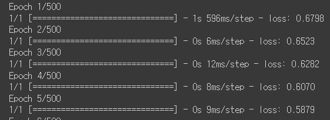

---

layout: single
title: "[Tensorflow 자격증] 2주차: DNN으로 Computer Vision 맛보기]"
categories: Tensorflow
tag: [tensorflow, deep learning]
toc: true
author_profile: false
sidebar:
    nav: "docs"

---

# Beyond Hello World!

  

인공지능의 장점은 프로그램 작성자가 데이터에 존재하는 패턴이나 룰을 알지 못하더라도, 인공지능이 대신 학습한다는 것입니다.

  

그 중 딥러닝은 인간의 뇌와 비슷한 구조로 이루어진 신경망의 형태를 통해 패턴을 학습하고 결과를 예측한다는 점에서 신기하게 느껴집니다.

  

이번 시간은 Tensorflow를 사용하는 첫 시간이니까, 복잡하고 어려운 모델 대신 가장 기본적인 신경망을 실습해 볼까요.

- 두 숫자 사이의 관계를 학습하는 신경망을 만들어 봅시다!

  

먼저, 우리가 이미 두 숫자 사이에 존재하는 관계, 즉 룰을 알고 있다고 해봅시다. 예를 들어, 다음과 같은 경우입니다.

```python
def hw_function(x):
    y = (2 * x) - 1
    return y
```

  

그렇다면, 신경망이 위의 "y = 2x - 1"과 동일한 작업을 하도록 훈련시키려면 어떻게 해야 할까요?

- **룰을 모르는 상태이므로, 데이터를 통해 훈련시킵니다!**
- 이러한 특징은 인공지능이 전통적인 프로그래밍과 확연하게 차이나는 부분이라고 할 수 있겠습니다.

  

과정을 더 디테일하게 알아보겠습니다.

  

  

## 코딩 시작!

  

  ```python
  import tensorflow as tf
  
  print(tf.__version__)
  ```

<pre>
2.8.0
</pre>


우선 Tensorflow나 기타 편리한 라이브러리들을 사용하기 위해서는 당연히 "import"를 해야겠죠.

  

이번에는 Tensorflow, numpy, keras를 불러오겠습니다.

- 사용상의 편의를 위해 Tensorflow는 "tf"로 약칭합니다.
- numpy는 데이터를 array로 표현하고, 수학적인 작업을 하는 데 용이한 라이브러리입니다.
- keras는 신경망의 레이어를 구성하는 데 사용됩니다.


```python
# import (불러오기)
import tensorflow as tf
import numpy as np
from tensorflow import keras

# tensorflow 버전 확인하기
print(tf.__version__)
```


## 신경망을 정의하고 컴파일하기

  

지금부터 아주 간단한 신경망을 하나 만들어보겠습니다. 하나의 뉴런과 레이어만으로 구성되고, input shape 역시 [1]로서 스칼라 값입니다.

- 레이어의 구성은 keras 라이브러리의 **Sequential** 속성을 사용하고, 종류는 **Dense** 레이어를 사용합니다.


```python
# 간단한 모델 만들기
model = tf.keras.Sequential([keras.layers.Dense(units=1, input_shape=[1])])
```

  

  

다음으로는, 구성한 모델을 컴파일하는 작업을 수행합니다. "컴파일(Compile)"을 영어사전에 검색하면 "엮다"라는 뜻이 나오는데, 쉽게 말하면 "**층들을 쌓아 만든 모델을 loss function이나 optimizer 등과 엮어주는 작업**" 이라고 생각하면 될 것 같습니다.

  

**loss function**은 모델이 예측한 답안과 실제 정답을 비교해 모델이 얼마나 잘했나/못했나를 판단합니다.  loss는 낮을 수록 좋은 척도입니다.

  

**optimizer**는 loss function의 흐름을 고려해서, loss를 최소화 시키는 방향으로 다음 예측을 만드는 역할입니다. 

  

**모델의 훈련이란** - 모델이 예측을 하고, loss function으로 loss를 구하고, optimizer로 loss를 낮추면서 다음 예측을 생성하는 일련의 과정이라고 할 수 있겠네요. 이러한 과정은 **epoch**(훈련을 몇 번 반복할 것인지)만큼 이루어지게 됩니다.

  

  

loss function과 optimizer에는 여러 종류가 있는데, 이번에는 그 중에서 "**mean squared error(MSE)**"와 "**stochastic gradient descent(SGD)**"를 사용해 보겠습니다.

```python
# 모델 컴파일하기
model.compile(optimizer='sgd', loss='mean_squared_error')
```

  

  

  

## 데이터 공급하기

  

모델을 구성했으면, 이제는 데이터를 feed, 쉽게 말해 "먹여줄" 차례입니다. 이번에는 간단하게 X, Y 6쌍만 사용했고, 초반부에 살펴봤던 함수 "Y = 2X - 1"의 관계와 일치하도록 값을 설정했습니다.

  

딥러닝, 신경망에 입력되는 데이터는 **Tensor** 혹은 **Numpy 배열**의 구조로 이루어집니다. 이번에는 Numpy 배열로 구성해 보았습니다.

  

```python
# 훈련을 위한 데이터셋 - x: input, y: output으로
xs = np.array([-1.0,  0.0, 1.0, 2.0, 3.0, 4.0], dtype=float)
ys = np.array([-3.0, -1.0, 1.0, 3.0, 5.0, 7.0], dtype=float)
```

  

  

  

## 신경망 훈련시키기

  

model.fit()을 호출하면 드디어 모델을 훈련시킬 수 있습니다. 이 단계에서야 비로소 앞에서 살펴봤던 순환과정(예측하고, loss를 계산하고, optimizer로 다음 예측을 생성)이 이루어지게 됩니다.

- input과 output을 지정해주고, epochs도 지정해 줍니다.

  

  

- 500번이나 훈련을 하기 때문에 코드가 너무 길어서 일부분만 캡쳐해 보겠습니다.

```python
# 모델 훈련시키기!
model.fit(xs, ys, epochs=500)
```

<center></center> 

  

  

훈련이 끝났으니, 모델은 x와 y의 관계를 학습한 상태일 것입니다. 이제는 훈련에 사용된 x 이외의 값을 모델에 넣어서 y를 예측해 봅시다. 과연 모델은 "y = 2x - 1"의 관계를 성공적으로 학습해 냈을까요?

- x=10을 예시로 해 봅시다.

  

  

```python
# 예측을 해보자
print(model.predict([10.0]))
```

<pre>
[[18.987158]]
</pre>


함수대로라면 x=10일때 y=19이어야 할 것이지만, 모델은 그보다 살짝 낮은 18.98... 의 값으로 예측했습니다.

  

이러한 현상은 신경망이 확률에 기반하고 있기 때문으로 생각합니다. 즉 모델에 데이터를 먹이면 모델은 높은 확률로 x와 y의 관계가 "y = 2x - 1"일 것이라고 판단할 것입니다. 

하지만 예시에서는 단지 6개만의 데이터가 주어졌기 때문에 그 관계를 "확실하다"고 판단하기는 힘들 것이고, 따라서 19에 근사하는 값을 결과로 출력하는 것입니다.

  

이렇듯 신경망을 다룰 때에는 언제나 확률을 기반으로 하게 됩니다. 후에 다룰 classification 문제가 그 대표적인 예일 것입니다.

  

지금까지 신경망의 "Hello world" 격이라고 할 수 있는 가장 간단한 신경망과 그 구성에 대해 학습해 보았습니다. 아래에서는 퀴즈 풀이가 이어집니다.

  

  

  

  

# QUIZ: House Price Question

In this exercise you'll try to build a neural network that predicts the price of a house according to a simple formula.

So, imagine if house pricing was as easy as a house costs 50k + 50k per bedroom, so that a 1 bedroom house costs 100k, a 2 bedroom house costs 150k etc.

How would you create a neural network that learns this relationship so that it would predict a 7 bedroom house as costing close to 400k etc.

Hint: Your network might work better if you scale the house price down. You don't have to give the answer 400...it might be better to create something that predicts the number 4, and then your answer is in the 'hundreds of thousands' etc.

  

  

**요약하자면,**

1. 신경망을 구성해서 집값을 예측한다
2. 집의 가격 = 기본 50k + 침실 1개당 50k 라는 관계가 있다고 하자
3. 이 관계를 학습해서, 침실이 7개인 집의 가격을 400k에 가깝게 예측하도록 하자

- 힌트: 가격(y)를 스케일링하기(400k를 4라고 표현하는 등)

  

  

**풀이**

```python
# 사용할 라이브러리 불러오기
import tensorflow as tf
import numpy as np
from tensorflow import keras
```

```python
# 모델 정의하기
def house_model(x_new):
    xs = np.array([1.0, 2.0, 3.0, 4.0, 5.0, 6.0], dtype=float)
    ys = np.array([1, 1.5, 2, 2.5, 3, 3.5], dtype=float)
    model = keras.Sequential([keras.layers.Dense(units=1, input_shape=[1])])
    model.compile(optimizer='sgd', loss='mean_squared_error')
    model.fit(xs, ys, epochs=500)
    return model.predict(x_new)[0]
```

```python
# 침실이 7개인 집값 예측하기
prediction = house_model([7.0])
print(prediction)
```

이전 epoch들은 생략

<pre>
Epoch 496/500
6/6 [==============================] - 0s 228us/sample - loss: 0.0028
Epoch 497/500
6/6 [==============================] - 0s 279us/sample - loss: 0.0028
Epoch 498/500
6/6 [==============================] - 0s 233us/sample - loss: 0.0028
Epoch 499/500
6/6 [==============================] - 0s 241us/sample - loss: 0.0028
Epoch 500/500
6/6 [==============================] - 0s 187us/sample - loss: 0.0028
[4.075857]
</pre>


